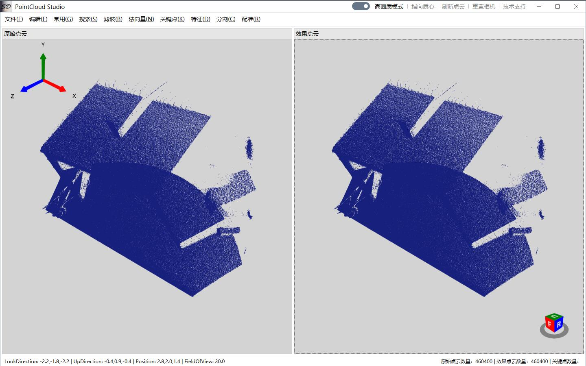

## 框架地址：https://gitee.com/lishilei0523/SD.Framework

#### 项目说明
> Windows与Linux环境下PCL点云库常用功能的.NET接口封装；

> 点云功能的可视化操作，包含PCL点云库的常用功能；

#### 开发目的：
    1、探索PCL常用点云算法；

    2、探索HelixToolkit及其与点云算法的结合应用；

    3、探索MahApps.Metro的各种控件应用；

    4、封装使用较为复杂的点云算法；
    
    5、方便算法开发人员测试调试算法；

#### 主要涉及技术：
    UI部分：WPF、HelixToolkit、FluentWPF、MahApps.Metro、Caliburn.Micro等；

    算法部分：PCL、SkiaSharp、Math.NET、ScottPlot、OnnxRuntime等；

    其他：P/Invoke互操作；

#### 主要功能模块：
    搜索部分：
        K近邻搜索、半径搜索、八叉树搜索等；

    滤波部分：
        直通滤波、随机采样、均匀采样、体素降采样、离群点移除等；

    法向量部分：
        K估算法向量、半径估算法向量等；

    关键点部分：
        NARF关键点、ISS关键点、SIFT关键点、Harris3D关键点、SUSAN关键点等；

    特征部分：
        NARF特征、PFH特征、FPFH特征、3DSC特征、SHOT特征等；

    分割部分：
        分割平面、分割球体、欧几里得聚类分割、区域生长分割等；
    
    其他部分：
        估算质心、盒子剪裁、仿射变换、投射平面、提取边界、点云配准等；

## 推荐

> 关联项目，OpenCV工作室：
> [OpenCV Studio](https://gitee.com/lishilei0523/OpenCV-Studio)

## 首页预览

